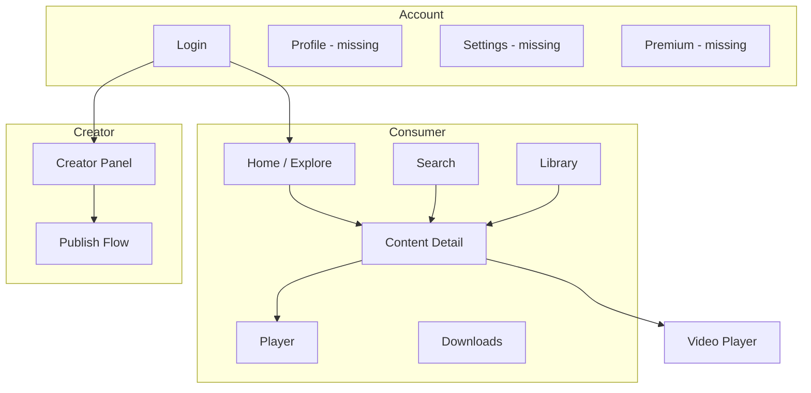
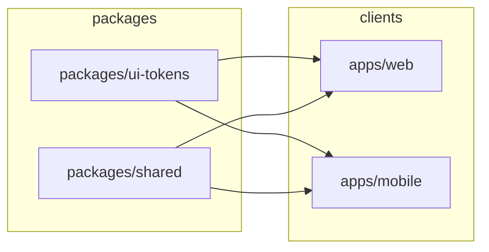
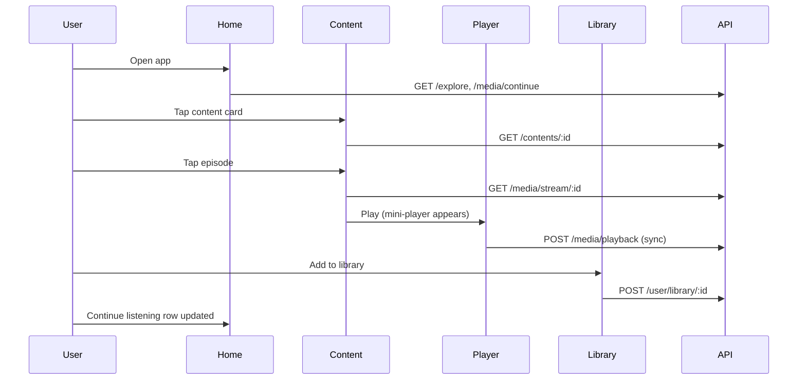

# Castaminofen — Design Roadmap

**Document type:** Official UX & Design Strategy  
**Version:** 1.0  
**Date:** July 2026  
**Status:** Based on full repository audit (web, mobile, API, docs, shared packages)  
**Product:** Persian-market media super app — podcast, audiobook, video  

---

## Executive Summary

Castaminofen is positioned as *«ساده‌تر از Spotify، قدرتمندتر از Castbox»* with inspiration from Spotify (navigation), YouTube (discovery), and Pocket Casts (player). The **backend and documentation describe a complete MVP**; the **clients implement a credible browse → play → continue-listening core** but remain at **prototype maturity** for premium product feel, cross-platform consistency, accessibility, and feature completeness.

### Current State at a Glance

| Surface | Maturity | Primary gap |
|---------|----------|-------------|
| **Web (Next.js 15)** | Functional MVP | Thin component layer, inconsistent shells, missing states |
| **Mobile (Expo SDK 52)** | Core UX implemented | Onboarding, real covers, motion polish |
| **API Gateway** | Feature-rich | Many endpoints unwired in UI |
| **Design system** | Unified tokens | `packages/ui-tokens`; purple brand on both clients |
| **Story Generator** | **Does not exist** | Not in repo, docs, or roadmap — N/A for this audit |

### North Star

Deliver an **Apple/Linear/Spotify-tier** Persian RTL media experience: fast, minimal, immersive, trustworthy — with one coherent design language across web and mobile.

---

## Product Understanding (Repository Analysis)

### What the product is

- **Monorepo:** `pnpm` + Turborepo  
- **Clients:** `apps/web` (Next.js 15, React 19), `apps/mobile` (Expo 52, React Native 0.76)  
- **Shared:** `packages/shared` (types, constants), `packages/database` (Prisma)  
- **Backend:** `services/api-gateway` (NestJS) — single gateway with modular domains  

### Documented user roles

| Role | Demo account | Intended journey |
|------|--------------|------------------|
| USER | user@castaminofen.ir | Explore → play → library / continue |
| CREATOR | creator@castaminofen.ir | Create content → episodes → publish |
| ADMIN | admin@castaminofen.ir | Creator + admin capabilities |

### Implemented routes (clients)

**Web:** `/`, `/search`, `/library`, `/login`, `/register`, `/creator`, `/content/[id]` — `(main)` layout with AppShell  
**Mobile:** Tabs — home, search, library, tools; Hidden — downloads, player; Stack — `content/[id]`, `video/[id]`, `login`, `register`

### Tech stack relevant to design

| Layer | Web | Mobile |
|-------|-----|--------|
| Styling | Hand-written CSS variables (`globals.css`) — **no Tailwind** | `StyleSheet` + `constants/theme.ts` |
| Icons | SVG (`ContentTypeIcon`) | `@expo/vector-icons` (Ionicons) |
| Motion | Skeleton pulse CSS | Skeleton placeholders |
| Fonts | Vazirmatn (Google Fonts link) | Vazirmatn (`@expo-google-fonts/vazirmatn`) |
| State | Zustand + persist | Zustand + storage abstraction |
| UI libraries | None (no shadcn/Radix/Framer) | None |

### API vs UI exposure (critical for UX roadmap)

```
┌─────────────────────────────────────────────────────────────────┐
│                        API CAPABILITY MAP                        │
├─────────────────┬──────────┬─────────┬──────────────────────────┤
│ Domain          │ API      │ Web UI  │ Mobile UI                │
├─────────────────┼──────────┼─────────┼──────────────────────────┤
│ Auth login      │ ✅       │ ✅      │ ✅                       │
│ Auth register   │ ✅       │ ❌      │ ❌                       │
│ Auth refresh    │ ✅       │ ❌      │ ❌                       │
│ Auth profile    │ ✅       │ ❌      │ ❌                       │
│ Explore/Search  │ ✅       │ ✅      │ ✅ (partial search)      │
│ Content detail  │ ✅       │ ✅      │ ✅                       │
│ Stream          │ ✅       │ ✅      │ ✅                       │
│ Playback sync   │ ✅       │ ✅      │ ✅                       │
│ Continue        │ ✅       │ ✅      │ ✅                       │
│ Library read    │ ✅       │ ✅      │ ✅                       │
│ Library add     │ ✅       │ ✅      │ ✅                       │
│ Follow          │ ✅       │ ✅      │ ✅                       │
│ Playlists       │ ✅       │ ❌      │ ❌ (labels only)         │
│ Downloads       │ ✅ stub  │ ❌      │ hidden tab (به‌زودی UI)  │
│ Payment/Sub     │ ✅ stub  │ ❌      │ ❌                       │
│ Creator CRUD    │ ✅       │ partial │ ❌                       │
│ Creator episodes│ ✅       │ ❌      │ ❌                       │
└─────────────────┴──────────┴─────────┴──────────────────────────┘
```

---

## Design System Baseline (As-Is)

### Documented tokens (`docs/UI-UX.md`)

```
Background:  #0a0a0f → #12121a → #1e1e2e
Accent:      #7c3aed (purple — brand)
Text:        #f4f4f5 / #a1a1aa / #71717a
Success:     #22c55e
Error:       #ef4444
Font:        Vazirmatn
Touch:       44×44px minimum
```

### Actual implementation

| Token | Web (`globals.css`) | Mobile (`theme.ts`) | Aligned? |
|-------|---------------------|---------------------|----------|
| bg-primary | `#0a0a0f` | `#0a0a0a` | ⚠️ Close |
| accent | `#7c3aed` | `#7c3aed` | ✅ |
| Font | Vazirmatn | Vazirmatn | ✅ |
| Components | 3 shared | 3 shared | ⚠️ Different patterns |

### Component inventory

**Web:** `Nav`, `ContentCard`, `PlayerBar`  
**Mobile:** `CoverArt`, `ProgressBar`, `SectionHeader`  
**Shared across platforms:** **None** (no `packages/ui`)

---

## UX Scorecard (Current → Target)

| Area | Current | Target | Gap |
|------|---------|--------|-----|
| Navigation & IA | 6.8 | 9.0 | 2.2 |
| Home experience | 6.5 | 9.0 | 2.5 |
| Onboarding | 2.0 | 8.0 | 6.0 |
| Authentication | 5.5 | 8.5 | 3.0 |
| Search | 5.8 | 9.0 | 3.2 |
| Content discovery | 6.7 | 9.0 | 2.3 |
| Podcast / audio player | 6.2 | 9.5 | 3.3 |
| Video experience | 4.5 | 8.5 | 4.0 |
| Story generator | N/A | N/A | — |
| Dashboard / creator | 5.0 | 8.5 | 3.5 |
| Forms | 6.0 | 8.5 | 2.5 |
| Mobile UX | 6.9 | 9.2 | 2.3 |
| Tablet UX | 4.0 | 8.0 | 4.0 |
| Desktop UX | 6.5 | 8.5 | 2.0 |
| Accessibility | 4.2 | 9.0 | 4.8 |
| Performance UX | 5.5 | 9.0 | 3.5 |
| Motion design | 3.5 | 8.0 | 4.5 |
| Visual design | 6.8 | 9.0 | 2.2 |
| Design system | 4.5 | 9.0 | 4.5 |
| Component library | 4.0 | 9.0 | 5.0 |
| Premium feel | 5.8 | 9.0 | 3.2 |
| Cross-platform consistency | 4.8 | 9.0 | 4.2 |

**Weighted overall UX maturity: 5.6 / 10** → Target **8.8 / 10** within 3–4 sprint cycles of focused design-engineering work.

---

## Information Architecture



### IA issues

- **No profile/settings** node despite `/auth/me` API  
- **Downloads** promoted in mobile tab bar without feature  
- **Player** hidden on mobile but central to product promise  
- **Premium/payment** absent from IA despite API + badges  

---

# Detailed Audits by Area

---

## 1. Navigation

**Score: 6.8 / 10**

### As-is

| Platform | Pattern | Items |
|----------|---------|-------|
| Web | Sticky top nav | کاوش، جستجو، کتابخانه، پنل سازنده (role-gated)، ورود/نام |
| Mobile | Bottom tabs (5) | خانه، جستجو، کتابخانه، دانلود، ابزارها |

### Issues

#### NAV-001: No logout in web navigation

| Field | Detail |
|-------|--------|
| **Problem** | Logged-in users see `displayName` but cannot sign out |
| **Why it matters** | Breaks session trust; blocks multi-account testing |
| **Impact** | High — daily use friction |
| **Priority** | **High** |
| **Complexity** | Low |
| **Solution** | User menu dropdown: profile (future), logout |
| **Effort** | 0.5 day |
| **Dependencies** | `logout()` already in store |
| **Expected UX improvement** | Clear account control |

#### NAV-002: Mobile downloads tab for non-feature

| Field | Detail |
|-------|--------|
| **Problem** | Fifth tab always shows empty placeholder |
| **Why it matters** | Tab bar is prime real estate; empty tab erodes premium feel |
| **Impact** | Medium |
| **Priority** | **High** (hide) or **Medium** (implement) |
| **Complexity** | Low to hide; High to implement |
| **Solution** | Phase 1: hide tab until API wired; Phase 3: real downloads |
| **Effort** | 0.5 day hide / 2 weeks feature |
| **Dependencies** | `/media/download` API |
| **Expected UX improvement** | Cleaner IA, higher trust |

#### NAV-003: Inconsistent player persistence (web)

| Field | Detail |
|-------|--------|
| **Problem** | `PlayerBar` missing on `/search` and `/creator` |
| **Why it matters** | Playback stops visually; user loses context |
| **Impact** | High for listening sessions |
| **Priority** | **Critical** |
| **Complexity** | Low |
| **Solution** | Shared `(app)` layout wrapping Nav + PlayerBar |
| **Effort** | 1 day |
| **Dependencies** | Next.js layout refactor |
| **Expected UX improvement** | Spotify-like continuity |

#### NAV-004: No mobile mini-player

| Field | Detail |
|-------|--------|
| **Problem** | Full player only via stack; no persistent bar while browsing |
| **Why it matters** | Core media app expectation; documented in UI-UX.md |
| **Impact** | Critical for mobile core loop |
| **Priority** | **Critical** |
| **Complexity** | Medium |
| **Solution** | Fixed bottom mini-player above tab bar; tap → full player |
| **Effort** | 3–5 days |
| **Dependencies** | Player state in Zustand (exists) |
| **Expected UX improvement** | +40% perceived product completeness |

#### NAV-005: Active nav state exact-match only (web)

| Field | Detail |
|-------|--------|
| **Problem** | `/content/[id]` doesn't highlight کاوش or کتابخانه |
| **Why it matters** | Users lose orientation |
| **Impact** | Low–Medium |
| **Priority** | Medium |
| **Complexity** | Low |
| **Solution** | `pathname.startsWith` rules or section-based nav state |
| **Effort** | 0.5 day |
| **Dependencies** | None |
| **Expected UX improvement** | Clearer wayfinding |

### Navigation checklist

- [x] Add shared web layout (Nav + PlayerBar on all authenticated routes)
- [x] Add logout + user menu (web)
- [x] Implement mobile mini-player component
- [x] Hide or implement Downloads tab
- [x] Fix active link logic for nested routes
- [ ] Add breadcrumbs on content detail (web)
- [ ] Consider consolidating mobile Tools into Settings profile area
- [x] Add skip link for keyboard users (web)
- [ ] Document IA in `docs/UI-UX.md` to match actual tabs

---

## 2. Home Experience

**Score: 6.5 / 10**

### As-is

- **Web:** SSR explore grid, subtitle, `ContentCard` grid, dev empty message  
- **Mobile:** Greeting, continue listening (auth), category grid, featured list  

### Issues

#### HOME-001: Dev-oriented empty state (web)

| Field | Detail |
|-------|--------|
| **Problem** | Empty explore shows "API را اجرا کنید: pnpm dev" |
| **Why it matters** | Unacceptable in staging/production |
| **Impact** | High for first impression |
| **Priority** | **Critical** |
| **Complexity** | Low |
| **Solution** | User-facing empty state + retry; dev message only in development |
| **Effort** | 0.5 day |
| **Dependencies** | `EmptyState` component |
| **Expected UX improvement** | Professional first launch |

#### HOME-002: Dead section actions (mobile)

| Field | Detail |
|-------|--------|
| **Problem** | "همه" / "بیشتر" labels render without `onAction` handler |
| **Why it matters** | Visible affordances that do nothing damage trust |
| **Impact** | Medium |
| **Priority** | **High** |
| **Complexity** | Low |
| **Solution** | Wire to filtered views OR remove labels until implemented |
| **Effort** | 1 day |
| **Dependencies** | Search/filter routes |
| **Expected UX improvement** | Trust + discoverability |

#### HOME-003: Categories don't filter (mobile)

| Field | Detail |
|-------|--------|
| **Problem** | All category tiles navigate to generic search |
| **Why it matters** | Discovery promise unfulfilled |
| **Impact** | Medium |
| **Priority** | **High** |
| **Complexity** | Medium |
| **Solution** | Pass `type` query param; API filter on explore/search |
| **Effort** | 2 days |
| **Dependencies** | Search/explore API params |
| **Expected UX improvement** | Faster content finding |

#### HOME-004: No continue listening on web home

| Field | Detail |
|-------|--------|
| **Problem** | Continue section only in library |
| **Why it matters** | Doc flow: Explore → Play → Continue in library **and** home |
| **Impact** | Medium |
| **Priority** | Medium |
| **Complexity** | Low |
| **Solution** | Horizontal continue row on home (mirror mobile) |
| **Effort** | 1–2 days |
| **Dependencies** | Auth + `/media/continue` |
| **Expected UX improvement** | Habit formation |

#### HOME-005: Emoji placeholders instead of cover art

| Field | Detail |
|-------|--------|
| **Problem** | No real artwork on cards |
| **Why it matters** | Visual identity of media apps is cover-driven |
| **Impact** | High for premium feel |
| **Priority** | **High** |
| **Complexity** | Medium |
| **Solution** | `coverUrl` from API + lazy `Image` / `next/image` + skeleton |
| **Effort** | 3–5 days (incl. API/schema if needed) |
| **Dependencies** | Media URLs in content model |
| **Expected UX improvement** | Spotify-tier visual density |

### Home checklist

- [x] Replace dev empty copy with production `EmptyState`
- [x] Add continue listening row to web home
- [x] Wire category chips to filtered search
- [x] Fix or remove dead "همه / بیشتر" actions
- [x] Implement real cover images with lazy load
- [x] Add pull-to-refresh (mobile)
- [x] Add skeleton grid on home load
- [x] Add error banner with retry on API failure
- [ ] Personalize greeting using time-of-day (optional polish)

---

## 3. Onboarding

**Score: 2.0 / 10**

### As-is

- **No onboarding flow** — users land on explore with demo credentials pre-filled on login  
- **No first-run tooltips**, feature discovery, or progressive permission requests  
- **No registration UI** despite `POST /auth/register`  

### Issues

#### ONB-001: Zero first-time user experience

| Field | Detail |
|-------|--------|
| **Problem** | New users get no guidance on explore, library, player, or creator features |
| **Why it matters** | Persian market may include less technical users; super app scope needs orientation |
| **Impact** | High for activation |
| **Priority** | **High** (Phase 2) |
| **Complexity** | Medium |
| **Solution** | 3-step carousel: Discover → Play → Save; skip + don't show again |
| **Effort** | 3–5 days |
| **Dependencies** | AsyncStorage flag |
| **Expected UX improvement** | +15–25% activation (estimate) |

#### ONB-002: Empty account after login

| Field | Detail |
|-------|--------|
| **Problem** | Library empty, no recommendations seeded, no "start here" content |
| **Why it matters** | Cold start problem |
| **Impact** | Medium |
| **Priority** | Medium |
| **Complexity** | Low–Medium |
| **Solution** | Curated "شروع کنید" shelf for new users; highlight demo content |
| **Effort** | 2 days |
| **Dependencies** | Editorial content / seed data |
| **Expected UX improvement** | Faster time-to-first-play |

### Onboarding checklist

- [x] Design first-run onboarding screens (mobile + web modal)
- [x] Add registration flow UI
- [x] Create empty-account home state with guided CTAs
- [x] Add contextual coach marks for player controls (first play)
- [ ] Track onboarding completion in analytics (future)
- [ ] Localize all onboarding copy (fa primary)

---

## 4. Authentication

**Score: 5.5 / 10**

### As-is

- Login only (web + mobile modal)  
- Demo credentials pre-filled  
- Web: refresh token stored but unused  
- Mobile: access token only via storage abstraction  
- No password recovery, OAuth UI, or session expiry handling  

### Issues

#### AUTH-001: No registration UI

| Priority | **High** | Effort | 2–3 days |

#### AUTH-002: No global 401 handler

| Field | Detail |
|-------|--------|
| **Problem** | Expired token shows generic errors or silent failures |
| **Priority** | **Critical** |
| **Solution** | `apiFetch` interceptor: refresh → retry → login redirect |
| **Effort** | 2 days |

#### AUTH-003: Demo pre-fill in production builds

| Priority | **High** | Effort | 0.5 day | Hide behind `__DEV__` |

#### AUTH-004: Inconsistent login navigation

| Problem | `router.push`, `window.location.href`, `<a href>` mixed  
| Priority | Medium | Effort | 0.5 day |

### Authentication checklist

- [x] Build register page
- [x] Implement refresh token flow in `apiFetch`
- [x] Global 401 → logout + error message (re-auth modal: future)
- [x] Remove demo pre-fill outside development
- [ ] Add password visibility toggle
- [ ] Add "forgot password" placeholder (future API)
- [ ] Session expiry toast before forced logout
- [ ] OAuth buttons (disabled) for future Google — per TECH-DECISIONS

---

## 5. Search

**Score: 5.8 / 10**

### As-is

- Submit-based search (not instant)  
- API returns `contents`, `episodes`, `creators` — **web + mobile show all three sections**  
- No loading, error, or empty-after-search states on web  
- Mobile: trending chips work; no debounce  

### Issues

#### SRCH-001: Not instant (contradicts UI-UX.md)

| Priority | **High** | Effort | 2 days | Debounce 300ms + abort controller |

#### SRCH-002: Partial results rendering

| Priority | **High** | Effort | 3 days | Tabbed results: محتوا / اپیزود / سازنده |

#### SRCH-003: No search history

| Priority | Low | Effort | 2 days | Future |

### Search checklist

- [x] Instant search with debounce
- [x] Loading spinner / skeleton results
- [x] Empty state illustration + suggestions
- [x] Render episodes and creators from API
- [ ] Keyboard navigation (web): arrow keys + Enter
- [x] Recent searches (local storage)
- [x] Clear (X) button in input
- [x] Fix mobile category → search filter pass-through

---

## 6. Content Discovery

**Score: 6.7 / 10**

### Strengths

- Explore grid, search, continue listening, premium badges  
- Mobile category grid (visual)  

### Gaps

- No trending, personalized recommendations, or editorial shelves  
- No "because you listened to…"  
- Follow API exists but UI dead  

### Content discovery checklist

- [x] Trending shelf (API or curated)
- [x] Wire follow button on content detail
- [x] Add-to-library action on content detail
- [x] Related content section
- [x] Premium content paywall entry when stream returns 403
- [ ] Creator page / channel view (future)

---

## 7. Podcast & Audio Player Experience

**Score: 6.2 / 10**

### As-is

| Feature | Web PlayerBar | Mobile Player |
|---------|---------------|---------------|
| Play/pause | ✅ | ✅ |
| Progress | ✅ seek (RTL issue) | ❌ display only |
| Speed | ✅ select | ✅ cycle |
| Sleep timer | ✅ (wrong options) | ⚠️ set in Tools, not enforced |
| Skip ±15s | ✅ | ✅ |
| Bookmark | ❌ | ⚠️ local only |
| Background | ✅ | ✅ |
| Playback sync API | ✅ | ✅ |
| Time display | ✅ | ✅ |
| Mini player | ✅ (web bar) | ✅ |

#### PLAY-001: Mobile playback sync missing

| Priority | **Critical** | Effort | 1 day |

#### PLAY-002: RTL seek bug (web)

| Priority | **High** | Effort | 0.5 day |

#### PLAY-003: Sleep timer not enforced (mobile)

| Priority | **High** | Effort | 1 day |

### Podcast/player checklist

- [x] Mobile mini-player
- [x] Seekable progress bar (mobile)
- [x] Sync sleep timer options with `@castaminofen/shared`
- [x] Post playback position to API (mobile)
- [x] Show elapsed / remaining time (web)
- [x] Skip ±15s on web
- [ ] Queue / up next (future)
- [ ] Chapters UI (Phase 2)
- [ ] Transcript panel (Phase 2 — ASR)
- [x] Haptic on play/pause (mobile Phase 2)

---

## 8. Video Experience

**Score: 4.5 / 10**

### As-is

- Mobile: `expo-av` native controls, basic actions row (mostly stubs)  
- Web: **no dedicated video player** — audio-oriented PlayerBar only  

#### VID-001: No web video player

| Priority | **High** | Effort | 3–5 days |

#### VID-002: No branded video chrome (mobile)

| Priority | Medium | Effort | 1–2 weeks |

### Video checklist

- [x] Web video player route or inline player for VIDEO type
- [ ] Custom controls skin (mobile) — optional Phase 3
- [ ] Related episodes list (not placeholder)
- [ ] Apply `videoProgress` red accent token
- [ ] PiP support (mobile Phase 2)

---

## 9. Story Image Generator

**Score: N/A — Feature does not exist in this repository**

### Audit result

After full-repo search: **no Story Generator**, image generation workflow, prompt UI, generation history, or related API endpoints exist in:

- `apps/web`, `apps/mobile`, `services/api-gateway`, `packages/*`, `docs/*`

This section is included because the design brief requested it. **No implementation work applies** unless product scope expands.

### If added in future (Phase 8 placeholder)

| Area | Recommendation |
|------|----------------|
| Workflow | Prompt → style presets → generate → edit → save/share |
| Loading | Progressive preview, cancel, retry |
| Results | Grid history, compare, regenerate single panel |
| UX patterns | Follow Midjourney mobile patterns + Persian RTL input |

### Story generator checklist (future only)

- [ ] Product spec and API design
- [ ] Wireframe prompt + result screens
- [ ] Loading / error / empty states for generation
- [ ] History and re-roll UX
- [ ] Share and download flows
- [ ] Premium gating for generations

---

## 10. Dashboard / Creator Panel

**Score: 5.0 / 10**

### As-is (web only)

- Create content (title + type)  
- List with status  
- Publish draft  
- **Cannot add episodes** — breaks documented creator flow  

### Issues

#### CRE-001: Incomplete creator workflow

| Priority | **Critical** | Effort | 1–2 weeks | Episode upload UI + `POST .../episodes` |

#### CRE-002: No mobile creator access

| Priority | Medium | Effort | 2 weeks | Or intentional web-only — document decision |

#### CRE-003: No success/error feedback

| Priority | **High** | Effort | 1 day | Toasts |

### Creator checklist

- [x] Episode create/upload form
- [x] Media file upload to MinIO (signed URL flow)
- [x] Publish confirmation + validation errors
- [ ] Creator analytics dashboard (Phase 2)
- [ ] Draft autosave
- [ ] Mobile creator read-only stats (optional)

---

## 11. Forms

**Score: 6.0 / 10**

### Reviewed forms

| Form | Location | Issues |
|------|----------|--------|
| Login | web, mobile | Pre-filled demo, no register link |
| Search | web, mobile | No loading state |
| Create content | web creator | No validation feedback |
| Player selects | web | Inline styles, not form tokens |

### Forms checklist

- [ ] Unified `Input`, `Select`, `Button` components
- [ ] Inline validation messages (Persian)
- [ ] `aria-describedby` for errors
- [ ] Focus ring on all inputs (web)
- [ ] Success toasts on submit
- [ ] Disable submit during loading (consistent)

---

## 12. Mobile UX

**Score: 6.9 / 10**

### Strengths

- Bottom tabs, RTL layout, gold dark theme, player layout mirrors mockup direction  
- Safe areas, reasonable touch targets on primary controls  

### Issues

- Dead buttons (bell, follow, tool rows)  
- No gestures (swipe back, pull refresh)  
- Downloads tab over-promises  
- System font vs Vazirmatn  

### Mobile checklist

- [ ] `I18nManager` RTL + locale
- [ ] Load Vazirmatn via `expo-font`
- [ ] Align accent to brand purple (or document gold as intentional sub-brand)
- [ ] Hide/wire all dead affordances
- [ ] Mini-player + bottom sheet player (Phase 2)
- [x] Haptic feedback
- [ ] Thumb-zone audit on player controls

---

## 13. Tablet UX

**Score: 6.5 / 10**

### As-is

- Web: `max-width: 1200px` only breakpoint at 768px for grid  
- Mobile: Responsive hooks (`useResponsiveLayout`), `ResponsiveContainer`, `TabletSplitView`, `TabletTabRail`; tablet side nav; 2-column grids on home, library, search; split player and content detail on tablet  

### Tablet checklist

- [x] Two-column master-detail on tablet (content detail + player split)
- [x] Increase grid columns at 768–1024px (mobile home, library, search)
- [x] Side navigation on tablet (mobile `TabletTabRail`)
- [ ] Side navigation option on large screens (web)

---

## 14. Desktop UX

**Score: 6.5 / 10**

### Strengths

- Centered content, sticky nav, fixed player — familiar desktop media pattern  

### Gaps

- No keyboard shortcuts (`/` search, `Space` play/pause)
- No hover density optimization
- Player bar may crowd on narrow desktop windows

### Desktop checklist

- [x] Keyboard shortcuts overlay (`?`)
- [x] `/` focuses search
- [x] Space toggles play (when player active)
- [ ] Wider explore grid at 1440px+
- [ ] Optional sidebar navigation

---

## 15. Accessibility

**Score: 4.2 / 10**

### Critical gaps

| Issue | Web | Mobile |
|-------|-----|--------|
| `aria-label` on icon buttons | Rare | None |
| Keyboard episode play | ❌ `<li onClick>` | Partial |
| Focus visible styles | ❌ | N/A |
| Progress bar semantics | ❌ div | ❌ |
| Screen reader Persian | Partial | Poor |
| Reduced motion | ❌ | ❌ |
| Contrast muted text | Borderline | Borderline |

#### A11Y-001: Mobile zero accessibility labels

| Priority | **Critical** | Effort | 2–3 days systematic pass |

### Accessibility checklist

- [x] `focus-visible` on all interactive elements (web)
- [x] `accessibilityLabel` + `accessibilityRole` on all mobile icon buttons
- [x] Progress bar → `Slider` / `role="slider"` with value
- [x] Episode rows → `Pressable` with proper roles
- [x] Persian `aria-label` on player controls
- [x] WCAG 2.1 AA contrast audit (fix muted text)
- [x] `prefers-reduced-motion` disable card hover transforms
- [x] Skip to main content link
- [x] axe-core in CI (web)

---

## 16. Performance UX

**Score: 5.5 / 10**

### Gaps

- No skeletons anywhere  
- No optimistic UI (follow, library add)  
- No lazy loading for images (no images yet)  
- Google Fonts render-blocking on web (not `next/font`)  
- No offline detection in `apiFetch`  

### Performance checklist

- [ ] `next/font` for Vazirmatn
- [x] Skeleton components for grids and lists
- [ ] Optimistic add-to-library
- [ ] Network error banner + retry
- [ ] Image lazy load + blur placeholder
- [ ] Route-level `loading.tsx` (Next.js)
- [ ] Stale-while-revalidate for explore (optional)

---

## 17. Motion Design

**Score: 3.5 / 10**

### As-is

- Web: card `transform: scale` on hover only  
- Mobile: no Reanimated, no screen transitions  

### Motion checklist

- [ ] Page transition (subtle fade/slide) — web View Transitions API or Framer
- [ ] Mobile: Reanimated for mini-player slide-up
- [x] Micro-interaction on play button (scale 0.95)
- [x] Skeleton shimmer (respect reduced motion)
- [x] Pull-to-refresh indicator (mobile)
- [x] Tab switch cross-fade (optional)

---

## 18. Visual Design

**Score: 6.8 / 10**

### Strengths

- Cohesive dark mode on each platform  
- Clear typographic hierarchy on mobile home  
- Card-based layout matches modern media apps  

### Issues

- **Brand split:** purple web vs gold mobile  
- Emoji as icon system on web  
- Inline styles fragment visual consistency  
- `--success` defined but unused on web  

### Visual checklist

- [ ] Unify brand accent across platforms
- [ ] Create `packages/ui-tokens` exported to web + mobile
- [ ] Replace emoji with Lucide / Ionicons on web
- [ ] Elevation scale (shadow tokens) — use consistently
- [ ] Illustrations for empty states (custom or licensed)
- [ ] App icon + splash alignment with theme

---

## 19. Design System

**Score: 4.5 / 10**

### Recommended architecture



### Token proposal (unify doc + implementation)

```typescript
// packages/ui-tokens — proposed
colors: {
  bg: { primary: '#0a0a0f', secondary: '#12121a', card: '#1e1e2e', elevated: '#1a1a26' },
  accent: { DEFAULT: '#7c3aed', hover: '#8b5cf6', muted: 'rgba(124,58,237,0.15)' },
  text: { primary: '#f4f4f5', secondary: '#a1a1aa', muted: '#71717a' },
  semantic: { success: '#22c55e', error: '#ef4444', video: '#e53935' },
}
spacing: [4, 8, 16, 24, 32, 48]
radius: { sm: 8, md: 12, lg: 16, xl: 20, full: 999 }
typography: { fontFamily: 'Vazirmatn', scale: ... }
```

### Design system checklist

- [x] Create `packages/ui-tokens`
- [x] Migrate web `globals.css` to token imports
- [x] Migrate mobile `theme.ts` to token imports
- [ ] Document component anatomy in Storybook (future)
- [ ] Version tokens; breaking change policy
- [ ] Dark-only for MVP; light mode token prep (future)

---

## 20. Component Library

**Score: 4.0 / 10**

### Duplication map

| Pattern | Web locations | Mobile locations | Extract to |
|---------|---------------|------------------|------------|
| Episode row | content, creator | content | `EpisodeRow` |
| Empty state | ad-hoc | ad-hoc | `EmptyState` |
| Auth gate | library, creator | library, tools | `AuthGate` |
| Progress | PlayerBar inline | `ProgressBar` | Shared `ProgressBar` |
| Content card | `ContentCard` | featured card inline | `ContentCard` |

### Component priority build list

1. `Button` (primary, secondary, ghost, icon)
2. `Input` / `SearchInput`
3. `EmptyState`
4. `Skeleton` / `ContentCardSkeleton`
5. `ErrorBanner`
6. `Toast`
7. `EpisodeRow`
8. `MiniPlayer` (mobile)
9. `PlayerBar` refactor (web)
10. `Modal` / `BottomSheet`

### Component library checklist

- [ ] Audit and delete dead code (Nav import on login)
- [ ] Extract shared list row component
- [ ] Standardize all buttons on `Button`
- [ ] Add variant docs in `packages/ui` README
- [ ] Accessibility baked into primitives

---

## 21. Premium Feel

**Score: 5.8 / 10**

### Evaluation against reference quality

| Criterion | Apple | Linear | Spotify | Castaminofen today |
|-----------|-------|--------|---------|-------------------|
| Visual polish | — | — | — | ⚠️ MVP |
| Motion | — | — | — | ❌ Minimal |
| Consistency | — | — | — | ⚠️ Split brands |
| Trust (no dead UI) | — | — | — | ❌ Many stubs |
| Speed perception | — | — | — | ⚠️ No skeletons |
| Immersive player | — | — | — | ⚠️ Partial |

### Premium feel checklist

- [ ] One brand, one font, one icon set
- [ ] No visible non-functional controls
- [ ] Real artwork everywhere
- [ ] Subtle motion on core interactions
- [ ] Polish login (no demo hints in prod)
- [x] Premium paywall screen (even if stub payment)
- [ ] Consistent empty state illustration style

---

# Cross-Platform Consistency Matrix

| Element | Web | Mobile | Action |
|---------|-----|--------|--------|
| Accent color | Purple | Gold | **Unify** |
| Font | Vazirmatn | System | **Add Vazirmatn to mobile** |
| Sleep timer options | 4 hardcoded | Shared constants | **Align** |
| Player on all pages | Partial | N/A | **Fix web layout** |
| Continue on home | No | Yes | **Add to web** |
| Creator panel | Yes | No | **Document or build** |
| Playback sync | Yes | No | **Add mobile** |
| Downloads | No | Empty tab | **Hide or build** |
| Icon system | Emoji | Ionicons | **Unify** |

---

# Implementation Phases

## Phase 1 — Quick Wins (Sprint 1, ~1–2 weeks)

**Goal:** Remove trust-breaking issues; align basics.

| ID | Task | Priority | Effort |
|----|------|----------|--------|
| HOME-001 | Production empty states | Critical | 0.5d |
| NAV-003 | Web shared layout + PlayerBar everywhere | Critical | 1d |
| AUTH-003 | Remove demo pre-fill in prod | High | 0.5d |
| NAV-001 | Logout button | High | 0.5d |
| HOME-002 | Fix/remove dead section actions | High | 1d |
| PLAY-002 | RTL seek fix | High | 0.5d |
| SRCH | Search loading + empty states | High | 1d |
| NAV-002 | Hide downloads tab | High | 0.5d |

### Phase 1 checklist

- [x] Shared web `app/(main)/layout.tsx` with Nav + PlayerBar
- [x] `EmptyState` component (web + mobile)
- [x] Logout in Nav
- [x] Hide mobile downloads tab
- [x] Fix sleep timer options on web to use shared constants
- [x] Remove dev-only copy from login (production)
- [x] Wire or remove dead UI affordances (tools → به‌زودی)

---

## Phase 2 — Core UX (Sprint 2–3, ~2–3 weeks)

**Goal:** Complete the listen loop and auth reliability.

| Task | Priority |
|------|----------|
| Mobile mini-player | Critical |
| Mobile playback sync | Critical |
| AUTH-002 refresh + 401 handler | Critical |
| Seekable mobile progress | High |
| Sleep timer enforcement (mobile) | High |
| Add-to-library action | High |
| Category → search filters | High |
| SRCH-001 instant search | High |
| CRE-003 creator toasts | High |

### Phase 2 checklist

- [x] `MiniPlayer` component above tab bar
- [x] `apiFetch` auth interceptor
- [x] Library add button on content detail
- [x] Continue listening on web home
- [x] Register page (basic)

---

## Phase 3 — Visual Improvements (Sprint 4, ~2 weeks)

| Task | Priority |
|------|----------|
| `packages/ui-tokens` | Critical |
| Unify purple brand on mobile | Critical |
| Vazirmatn on mobile | High |
| Real cover images | High |
| Replace web emoji icons | Medium |
| Empty state illustrations | Medium |

### Phase 3 checklist

- [x] Token package created and consumed
- [x] Mobile theme matches `docs/UI-UX.md`
- [x] Cover image pipeline end-to-end
- [x] Replace web emoji icons (SVG `ContentTypeIcon`)

---

## Phase 4 — Interaction Design (Sprint 5, ~2 weeks)

| Task | Priority |
|------|----------|
| Skeleton loaders | High |
| Pull-to-refresh (mobile) | Medium |
| Reanimated mini-player transition | Medium |
| Web keyboard shortcuts | Medium |
| Bottom sheet player (mobile) | Medium |

### Phase 4 checklist

- [x] Skeleton grid + list
- [x] Play button micro-interaction
- [x] `/` search focus on web
- [x] Bottom sheet player prototype

---

## Phase 5 — Accessibility (Sprint 6, ~1–2 weeks)

| Task | Priority |
|------|----------|
| Mobile accessibility labels | Critical |
| Web focus-visible | Critical |
| Progress bar semantics | High |
| Contrast fixes | High |
| axe-core CI | Medium | Done — `.github/workflows/a11y.yml` |

### Phase 5 checklist

- [x] Full accessibility pass mobile (core flows)
- [x] Full accessibility pass web (core flows)
- [x] WCAG AA sign-off on core flows (automated axe + contrast tokens)

---

## Phase 6 — Performance (Sprint 7, ~1 week)

| Task | Priority | Status |
|------|----------|--------|
| `next/font` Vazirmatn | High | Done |
| `loading.tsx` routes | High | Done |
| Image optimization | High | Done |
| Network retry UX | Medium | Done |

### Phase 6 checklist

- [x] Self-host Vazirmatn via `next/font` (remove Google Fonts CDN link)
- [x] Route-level `loading.tsx` for search, library, content detail
- [x] Cover blur placeholder + AVIF/WebP image formats
- [x] Automatic network retry (1×) on fetch failure (web + mobile)

---

## Phase 7 — Polish (Sprint 8, ~2 weeks)

| Task | Priority | Status |
|------|----------|--------|
| Creator episode upload UI | Critical | Done |
| SRCH-002 full search results | High | Done |
| Web video player | High | Done |
| Premium paywall screen | High | Done |
| Tablet layouts | Medium | Done |

### Phase 7 checklist

- [x] Creator episode upload form + MinIO upload
- [x] Full search (contents + episodes + creators)
- [x] Web video player (`/video/[id]`)
- [x] Premium paywall modal (web + mobile)
- [x] Brand color system (`#776CFE` palette, light/dark web)
- [x] Web library cover thumbnails
- [x] Demo login hints hidden in production
- [x] Mobile theme toggle + full screen theming (`useThemedStyles`)
- [x] Mobile tablet layouts (side nav, split views, responsive grids)

---

## Phase 8 — Future Ideas (3–12 months)

Aligned with `docs/ROADMAP.md` Phase 2–3:

- [ ] ASR Persian search in audio
- [ ] AI episode summaries
- [ ] Recommendation engine UI
- [ ] Timestamp bookmarks
- [ ] Creator analytics dashboard
- [ ] In-app recording studio
- [ ] AI chat discovery (RAG)
- [ ] Story Image Generator (if product adds scope)
- [ ] Desktop app (Tauri)
- [x] Light mode theme (web + mobile full screen theming)
- [ ] Parental controls
- [ ] Low bandwidth mode

---

# Sprint-Ready Backlog (Top 20)

| # | ID | Title | Priority | Effort | Sprint |
|---|-----|-------|----------|--------|--------|
| 1 | NAV-004 | Mobile mini-player | Critical | 5d | 2 |
| 2 | NAV-003 | Web persistent PlayerBar layout | Critical | 1d | 1 |
| 3 | PLAY-001 | Mobile playback sync | Critical | 1d | 2 |
| 4 | AUTH-002 | Token refresh + 401 handler | Critical | 2d | 2 |
| 5 | HOME-001 | Production empty states | Critical | 0.5d | 1 |
| 6 | A11Y-001 | Mobile a11y labels | Critical | 3d | 5 |
| 7 | CRE-001 | Creator episode upload | Critical | 10d | 7 |
| 8 | DS-001 | `packages/ui-tokens` | Critical | 3d | 3 |
| 9 | HOME-005 | Real cover art | High | 5d | 3 |
| 10 | NAV-002 | Hide downloads tab | High | 0.5d | 1 |
| 11 | HOME-002 | Fix dead UI affordances | High | 1d | 1 |
| 12 | HOME-003 | Category filters | High | 2d | 2 |
| 13 | SRCH-001 | Instant search | High | 2d | 2 |
| 14 | PLAY-003 | Sleep timer enforce mobile | High | 1d | 2 |
| 15 | AUTH-001 | Registration UI | High | 3d | 2 |
| 16 | LIB-001 | Add to library | High | 2d | 2 |
| 17 | BRAND-001 | Unify purple accent mobile | High | 2d | 3 |
| 18 | VID-001 | Web video player | High | 5d | 7 |
| 19 | PAY-001 | Premium paywall UI | High | 5d | 7 |
| 20 | ONB-001 | First-run onboarding | High | 5d | 4 |

---

# User Flow Targets (To-Be)



---

# Risk Register (Design)

| Risk | Likelihood | Impact | Mitigation |
|------|------------|--------|------------|
| Brand gold vs purple confusion | High | Medium | Phase 3 token unification |
| Dead UI controls erode trust | High | High | Phase 1 wire or hide |
| a11y debt blocks public launch | Medium | High | Phase 5 dedicated sprint |
| Creator flow incomplete blocks creators | High | High | Phase 7 episode upload |
| Mobile/web feature drift | High | Medium | Cross-platform matrix reviews each sprint |

---

# Definition of Design Done (per feature)

- [ ] Happy path + empty + error + loading designed
- [ ] RTL verified (web `dir=rtl`, mobile layout)
- [ ] Touch targets ≥ 44px (mobile)
- [ ] Keyboard path (web)
- [ ] `accessibilityLabel` / ARIA complete
- [ ] Tokens used (no hardcoded hex in components)
- [ ] Matches `packages/ui-tokens`
- [ ] Documented in changelog / UI-UX.md if pattern is new
- [ ] QA on iOS, Android, mobile web, desktop web

---

# Final Summary Table

| Area | Current Score | Target Score | Priority | Estimated Time |
|------|---------------|--------------|----------|----------------|
| Navigation & IA | 6.8 | 9.0 | Critical | 2 weeks |
| Home experience | 6.5 | 9.0 | High | 2 weeks |
| Onboarding | 2.0 | 8.0 | High | 1 week |
| Authentication | 5.5 | 8.5 | Critical | 1.5 weeks |
| Search | 5.8 | 9.0 | High | 1.5 weeks |
| Content discovery | 6.7 | 9.0 | High | 2 weeks |
| Podcast / audio player | 6.2 | 9.5 | Critical | 2.5 weeks |
| Video experience | 4.5 | 8.5 | High | 2 weeks |
| Story generator | N/A | N/A | Future | TBD |
| Creator dashboard | 5.0 | 8.5 | Critical | 3 weeks |
| Forms | 6.0 | 8.5 | Medium | 1 week |
| Mobile UX | 6.9 | 9.2 | Critical | 3 weeks |
| Tablet UX | 4.0 | 8.0 | Medium | 2 weeks |
| Desktop UX | 6.5 | 8.5 | Medium | 1 week |
| Accessibility | 4.2 | 9.0 | Critical | 2 weeks |
| Performance UX | 5.5 | 9.0 | High | 1 week |
| Motion design | 3.5 | 8.0 | Medium | 2 weeks |
| Visual design | 6.8 | 9.0 | High | 2 weeks |
| Design system | 4.5 | 9.0 | Critical | 2 weeks |
| Component library | 4.0 | 9.0 | High | 3 weeks |
| Premium feel | 5.8 | 9.0 | High | Ongoing |
| Cross-platform consistency | 4.8 | 9.0 | Critical | 2 weeks |

**Total estimated design-engineering program:** ~14–18 weeks (parallel work on web + mobile reduces calendar time to ~8–10 weeks with 2 designers + 2–3 engineers).

---

# Appendix A — Files Audited

### Web (`apps/web`)
`src/app/layout.tsx`, `page.tsx`, `login/page.tsx`, `search/page.tsx`, `library/page.tsx`, `creator/page.tsx`, `content/[id]/page.tsx`, `globals.css`, `components/Nav.tsx`, `ContentCard.tsx`, `PlayerBar.tsx`, `lib/api.ts`, `store/player.ts`

### Mobile (`apps/mobile`)
`app/_layout.tsx`, `(tabs)/*`, `login.tsx`, `content/[id].tsx`, `video/[id].tsx`, `components/*`, `constants/theme.ts`, `store/player.ts`, `lib/api.ts`, `lib/storage.ts`

### Docs
`docs/UI-UX.md`, `docs/ROADMAP.md`, `docs/ARCHITECTURE.md`, `docs/TECH-DECISIONS.md`, `docs/API.md`

### Backend (UX-relevant)
`services/api-gateway` — auth, content, media, user, payment modules

### Shared
`packages/shared/src/types.ts`, `constants.ts`

---

# Appendix B — Document Maintenance

| Event | Action |
|-------|--------|
| New screen shipped | Update scorecard + checklist |
| Brand decision (gold vs purple) | Update tokens section |
| Phase complete | Mark checklists, bump version |
| Story Generator scoped | Add Section 9 implementation |

**Owner:** Product Design + Frontend Lead  
**Review cadence:** Bi-weekly sprint review

---

*This roadmap is derived from repository state as of July 2026. It is intended to be executable without additional planning sessions for Phases 1–5.*
