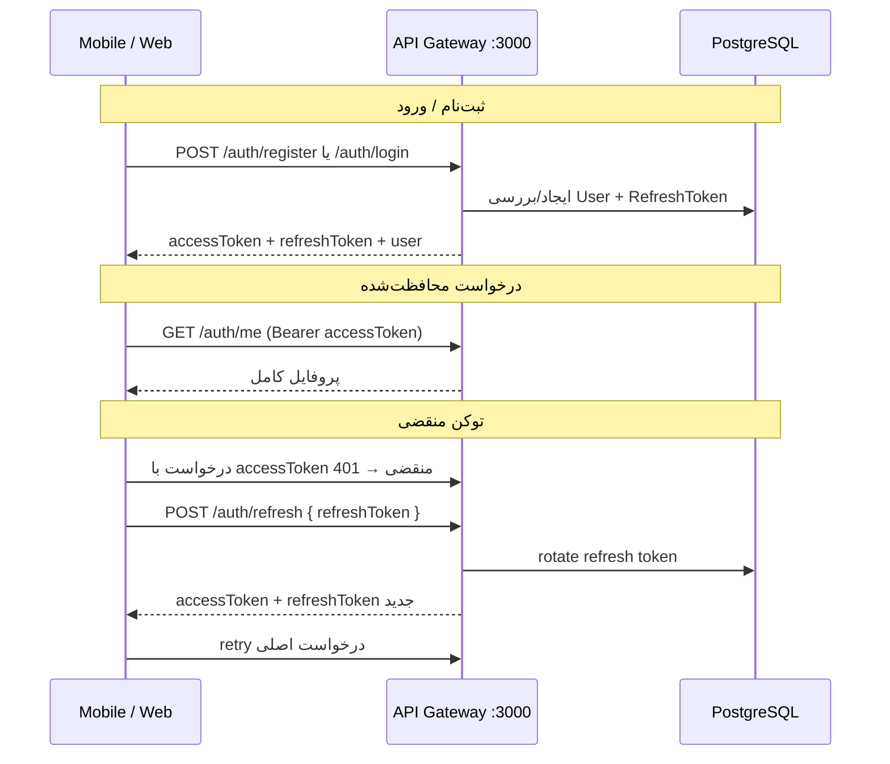

# سیستم ورود و ثبت‌نام (Login & Signup)

مستندات فنی سیستم احراز هویت کستامینوفن — شامل معماری، API، کلاینت‌ها و Roadmap.

---

## خلاصه

سیستم احراز هویت بر پایه **JWT + Refresh Token** پیاده‌سازی شده است:

| قابلیت | Backend | Mobile (Expo) | Web (Next.js) |
|--------|---------|---------------|---------------|
| ثبت‌نام | ✅ | ✅ `/register` | ✅ `/register` |
| ورود | ✅ | ✅ `/login` | ✅ `/login` |
| خروج | — | ✅ | ✅ |
| Refresh Token | ✅ | ✅ | ✅ |
| Hydrate پروفایل (`/auth/me`) | ✅ | ✅ | ✅ |
| Auto-refresh روی 401 | — | ✅ | ✅ |

---

## معماری



### توکن‌ها

| توکن | عمر پیش‌فرض | ذخیره‌سازی Mobile | ذخیره‌سازی Web |
|------|-------------|-------------------|----------------|
| Access Token (JWT) | ۷ روز | SecureStore / localStorage | localStorage (Zustand persist) |
| Refresh Token | ۳۰ روز | SecureStore / localStorage | localStorage (Zustand persist) |

---

## API Endpoints

Base URL: `http://localhost:3000/api/v1`

### POST `/auth/register` — ثبت‌نام

**Body:**
```json
{
  "email": "user@example.com",
  "password": "password123",
  "displayName": "نام کاربر"
}
```

**Validation:**
- `email`: فرمت ایمیل معتبر
- `password`: حداقل ۸ کاراکتر
- `displayName`: حداقل ۲ کاراکتر

**Response (200):**
```json
{
  "success": true,
  "data": {
    "accessToken": "...",
    "refreshToken": "...",
    "expiresIn": 604800,
    "user": {
      "id": "...",
      "email": "user@example.com",
      "displayName": "نام کاربر",
      "role": "USER"
    }
  }
}
```

**خطاهای رایج:**
- `409` — این ایمیل قبلاً ثبت شده است

---

### POST `/auth/login` — ورود

**Body:**
```json
{
  "email": "user@castaminofen.ir",
  "password": "password123"
}
```

**Response:** همان ساختار `register`

**خطاهای رایج:**
- `401` — ایمیل یا رمز عبور اشتباه است

---

### POST `/auth/refresh` — تازه‌سازی توکن

**Body:**
```json
{
  "refreshToken": "..."
}
```

**Response:**
```json
{
  "success": true,
  "data": {
    "accessToken": "...",
    "refreshToken": "...",
    "expiresIn": 604800
  }
}
```

Refresh token با هر استفاده **rotate** می‌شود (توکن قبلی باطل می‌گردد).

---

### GET `/auth/me` — پروفایل (نیاز به Bearer Token)

**Response:**
```json
{
  "success": true,
  "data": {
    "id": "...",
    "email": "...",
    "displayName": "...",
    "role": "USER",
    "subscription": { "plan": "FREE", "status": "ACTIVE" }
  }
}
```

---

## حساب‌های Demo

| نقش | ایمیل | رمز |
|-----|-------|-----|
| کاربر | user@castaminofen.ir | password123 |
| سازنده | creator@castaminofen.ir | password123 |
| ادمین | admin@castaminofen.ir | password123 |

---

## پیاده‌سازی کلاینت

### Shared Types (`packages/shared`)

```typescript
AuthUser, LoginRequest, RegisterRequest, AuthResponse, AuthTokens
```

### Mobile (`apps/mobile`)

| فایل | نقش |
|------|-----|
| `app/login.tsx` | صفحه ورود |
| `app/register.tsx` | صفحه ثبت‌نام |
| `components/AuthScreenLayout.tsx` | UI مشترک |
| `components/AuthProvider.tsx` | بارگذاری session در startup |
| `store/player.ts` | state توکن + user + refresh |
| `lib/api.ts` | `rawFetch` + `apiFetch` با auto-refresh |

**جریان ثبت‌نام:**
1. کاربر فرم را پر می‌کند
2. `POST /auth/register`
3. توکن‌ها در SecureStore ذخیره می‌شوند
4. کاربر به صفحه قبل redirect می‌شود

### Web (`apps/web`)

| فایل | نقش |
|------|-----|
| `src/app/login/page.tsx` | صفحه ورود |
| `src/app/register/page.tsx` | صفحه ثبت‌نام |
| `src/store/player.ts` | Zustand persist + hydrate |
| `src/lib/http.ts` | fetch پایه |
| `src/lib/api.ts` | auto-refresh روی 401 |
| `src/components/Nav.tsx` | لینک ورود/ثبت‌نام/خروج |

---

## راه‌اندازی برای تست

```bash
pnpm docker:up
pnpm db:migrate
pnpm db:seed

# API
pnpm --filter @castaminofen/api-gateway dev

# Mobile
pnpm --filter @castaminofen/mobile dev

# Web
pnpm --filter @castaminofen/web dev
```

Swagger: http://localhost:3000/docs

---

## Roadmap

### فاز ۱ — MVP (✅ انجام شده)

- [x] ثبت‌نام و ورود با ایمیل/رمز
- [x] JWT + Refresh Token
- [x] UI موبایل و وب
- [x] Persist session
- [x] Auto-refresh توکن
- [x] Hydrate پروفایل از `/auth/me`
- [x] پیام‌های خطای فارسی

### فاز ۲ — امنیت و UX

- [ ] **تأیید ایمیل** — فیلد `isVerified` در schema آماده است
- [ ] **فراموشی رمز عبور** — `POST /auth/forgot-password` + ایمیل
- [ ] **تغییر رمز عبور** — در تنظیمات حساب
- [ ] **Rate limiting** روی login/register (ThrottlerModule موجود است)
- [ ] **نمایش/مخفی کردن رمز** در فرم‌ها
- [ ] **Loading skeleton** هنگام hydrate

### فاز ۳ — OAuth

- [ ] ورود با Google (env: `GOOGLE_CLIENT_ID`)
- [ ] مدل `OAuthAccount` در Prisma آماده است
- [ ] Apple Sign-In برای iOS

### فاز ۴ — پیشرفته

- [ ] **2FA** (OTP پیامکی برای بازار ایران)
- [ ] **Session management** — لیست دستگاه‌های فعال
- [ ] **Auth store جدا** از player store
- [ ] **E2E tests** — Playwright (web) + Detox (mobile)
- [ ] **Biometric login** — Face ID / Touch ID (mobile)

---

## نکات توسعه

1. **Endpointهای عمومی** با decorator `@Public()` علامت‌گذاری شده‌اند.
2. برای endpointهای auth از `rawFetch` استفاده کنید (بدون auto-refresh).
3. برای APIهای محافظت‌شده از `apiFetch` استفاده کنید.
4. رمزها با **bcrypt** (12 rounds) hash می‌شوند.
5. پس از register، subscription رایگان (`FREE`) خودکار ایجاد می‌شود.

---

## Swagger

تمام endpointها در http://localhost:3000/docs مستند شده‌اند.

Tag: **Auth**
